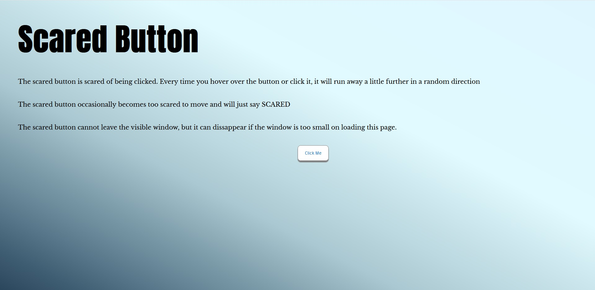

# ScaredButton
A project to practice using React, featuring a button that runs away from the user

## Purpose

A single page html project to practice using React components directly in an html page.
The button in the middle is a React component, and there are three events for this component; onMouseOver, onMouseOut and onClick.
- onMouseOver the button text and styling change and a random response from a defined set of responses is displayed as the text.
- onClick if you actually click the button it also triggers a style and text change in response.
- onMouseOut the style of the button changes again back to the default colours and again the button says Click Me. The second part of the onMouseOut event is that the button then moves in a random direction away from it’s current position. The amount the button moves slowly increases each time this event occurs.
If the button cannot move then the style changes to reflect this and it says ‘scared’.
The button movement is confined to the visible window, the dimensions of the window are updated in the onMouseOut event, so if the window is resized then the button is restricted to the new window size.

## Video Link - https://youtu.be/kyuLlcKg4KI 

